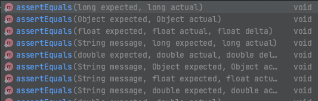

# Polymorphism & Composition Homework - Quiz

# Polymorphism

1. What does the ___word___ 'polymorphism' mean?

It means being able to have many forms. In programming terms, it's being able to give an object the ability to be categorised and recognised as a different type, which then gives the programmer the ability to use functions/methods that take in a wide variety of Objects categorised by a said type. This eliminates the need for duplicate/similar code and keeps the code 'dry'. 

2. What does it mean when we apply polymorphism to OO design? Give a simple Java example.

The example below is taken from an interface which allows the Customer and DealerShip classes to be use the buy() function with a variety of Vehicle subclasses. The Customer and Dealership subclasses which extend Asset and implement this interface also are able to use the sell() function with both subclasses of Asset and all subclasses of Vehicle. 

Dynamic:
```
public interface ITrade {

    void buy(Vehicle vehicle);

    void sell(Asset asset, Vehicle vehicle);

}
```
The example below shows the different types of object that can be passed into the same method via method overloading. 
Static:



3. What can we use to implement polymorphism in Java?

Dynamic PM via Abstract classes and Interfaces, Static PM via method overloading. 

4. How many 'forms' can an object take when using polymorphism?

It depends on the total amount of the extended super class + the amount of implemented interfaces. 

5. Give an example of when you could use polymorphism.

For example if you were to create a program which had a super class which subclasses extended from, i.e. an abstract stringedInstrument class which had subclasses Guitar, Violin, Bass etc. All of these classes/objects would have access to the functions/methods written in stringedInstrument as they are also of type stringedInstrument, as well as being able to be passed into any method that required the parameter of a stringedInstrument, which would eliminate the need for duplicate codes catering to the types of guitar, violin and bass etc. 


# Composition and Aggregation

6. What do we mean by 'composition' in reference to object-oriented programming?

Composition is the process of creating and linking an object to another object through the establishment of a "is a part of" relationship . If the object being linked to is deleted/erased, the linked object dissappers with it as it only exists when the object linked to is created. 

7. When would you use composition? Provide a simple example in Java.

```
public class String{
    private int gauge;

    public String(int gauge){
        this.gauge = gauge;
    }
    ...
}

public Class Guitar{
    private String string1;
    private String string2;
    private String string3;
    private String string4;
    private String string5;
    private String string6;

    public Guitar();
    this.string1 = new String(10);
    this.string2 = new String(13);
    this.string3 = new String(17);
    this.string4 = new String(26);
    this.string5 = new String(36);
    this.string6 = new String(46);
}

```

8. Give a difference between composition and aggregation?

In Aggregation the objects contained within an object can exist indepentently from said object. In composition, the composing objects only exist when the composed object does. 

9. What is/are the advantage(s) of using composition/aggregation?

Composition/aggregation is not bound by the limitations of Inheritance, which only allows to inherit from one thing only. Using composition/aggregation means that we can compose our classes from other classes which implement the required behaviours. 

10. When using composition, when an object is destroyed, what happens to all the objects it is composed of?

All the objects are destroyed along with the composed object. 

11. When using aggregation, when an object is destroyed, what happens to all the objects it is composed of?

The objects that compose the destroyed object will still exist as they were created prior to the creation of the destroyed object, and were used to create the destroyed object by being passed into the constructor of the destroyed object. Destroyed, destroyed, destroyed, destroyed. (Just in case you were thinking the word destroyed was being under utilised)